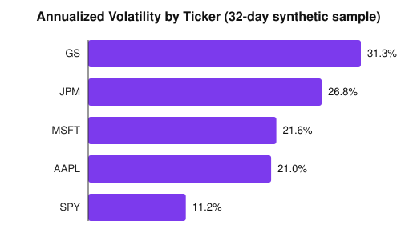

# Equity Market Data Analysis

Analyzing daily price data for a small basket of equities to compute returns, rolling volatility, and standard risk metrics (Sharpe ratio, max drawdown, correlation) using SQL and Python.

## Project Overview

Business questions addressed: how volatile is each stock and how does it compare on a risk-adjusted basis, what's the worst peak-to-trough drawdown each stock experienced in the sample window, and how correlated are these stocks' daily returns.

## Tech Stack

| Area | Tools |
|---|---|
| Data querying | SQL (window functions for returns and rolling volatility) |
| Data analysis | Python, Pandas, NumPy |
| Environment | Jupyter Notebook / script |
| Version control | Git & GitHub |

## Dataset

`data/stock_prices.csv` holds daily closing prices for 5 tickers (AAPL, MSFT, JPM, GS, SPY) over a 32-trading-day sample window. This is synthetic, illustrative data (a random walk seeded to resemble realistic daily price movement), generated to demonstrate the analysis methodology rather than to represent actual historical returns. Swap in real data (e.g. via `yfinance`) to run this on live markets.

## Repository Structure

```
equity-market-data-analysis/
  data/
    stock_prices.csv         (sample daily close prices, 5 tickers)
  notebooks/
    market_analysis.py       (returns, volatility, Sharpe, drawdown, correlation)
  sql/
    risk_queries.sql         (window-function queries for returns and rolling volatility)
  requirements.txt
  README.md
```

## Methodology

**Returns.** Daily simple return = close_t / close_(t-1) - 1, per ticker.

**Volatility.** Annualized volatility = daily return standard deviation x sqrt(252).

**Sharpe ratio.** (mean daily return - daily risk-free rate) / daily return standard deviation x sqrt(252), using a 4.5% annual risk-free rate.

**Max drawdown.** Largest peak-to-trough decline in price over the sample window.

**Correlation.** Pairwise correlation of daily returns across tickers.

## Key Insights (Sample)

| Ticker | Ann. Volatility | Sharpe Ratio | Max Drawdown |
|---|---|---|---|
| AAPL | 21.0% | 3.98 | -3.5% |
| MSFT | 21.6% | -0.85 | -9.0% |
| JPM | 26.8% | 1.55 | -10.1% |
| GS | 31.3% | -2.80 | -13.2% |
| SPY | 11.2% | 2.89 | -2.0% |

SPY (the broad market ETF) shows the lowest volatility and drawdown of the group, as expected for a diversified index versus single names. Correlations between individual stocks in this sample were low (mostly between -0.23 and +0.20), which is a property of the synthetic random-walk data rather than a real-world finding -- real equities in the same sectors typically show meaningfully higher correlation.

Metrics come from a short 32-day synthetic sample, so annualized figures are noisy by construction -- they illustrate the calculation method, not real market expectations.




## Skills Demonstrated

SQL window functions for time-series calculations (returns, rolling volatility). Risk metric calculation in Python (volatility, Sharpe ratio, drawdown, correlation). Translating raw price data into risk-adjusted performance comparisons.

## How to Use

**Clone the repository:**

```
git clone https://github.com/FurYangi/equity-market-data-analysis.git
cd equity-market-data-analysis
```

**Install dependencies:**

```
pip install -r requirements.txt
```

**Run the analysis:**

```
python notebooks/market_analysis.py
```

Explore the SQL queries in `sql/risk_queries.sql` against the same data loaded into SQLite or PostgreSQL.

## License

This project is licensed under the MIT License - see the LICENSE file for details.
